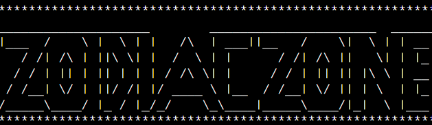

# Zodiac Zone

### **[Live link to deployed application.](https://zodiac-zone.herokuapp.com/)**

# Table of contents:
- ##  [Context](#context)
- ##  [Design](#Design)
     - [Target audience](#Target-audience)
     - [Overview](#Overview)
     - [User Stories](#User-stories)
     - [Flowchart](#Flowchart)
# Context

Zodiac zone is a random Horoscope generator. It uses the standard Western astrology and the twelve [Astrological signs](https://en.wikipedia.org/wiki/Astrological_sign) associated with western horoscopes.

The application is simple:
- Asks the user to input name.
- Asks the user for Month of birth.
- Asks the user for Day of birth.
- Generates a random Horoscope and displays the outcome.
- Provides user with random generated lucky lotto numbers
- Provides user with random lucky color.
- Provides the user with another zodiac sign the might like to get to know.

This application is for fun and out come from the users input is generated randomly.

# Design

## Target Audience
 - Anyone who enjoys Zodiac related material.
 - Any user who is interested in a short but fun application
 - New Users who would like to try something fun and personal.

## Overview
  - Simple to use
  - Responsive feedback
  - Insightful but positive outcome from random generated horoscopes
  - Fun and interactive application.

## User stories

  ### First time user:
  1. To be able to access the application with ease.
  2. Have clear navigation.
  3. Easy to read and understand instructions.
  4. Fun interactive application

  ### Returning user:
  1. To be entertained.
  2. Navigate with ease
  3. Clear easy path to starting and restarting the application

  ### As site owner:
  1. To be able the output from the generated horoscopes
  2. To make a fun and entertaining application
  3. To make sure the user has fun using the application.

  ## Flowchart

I designed a basic flowchart on [Lucid Chart](https://www.lucidchart.com/) first.This was to give me a template to follow and to make sure my original design that I had planned was the outcome and final layout of the application. This was an essential piece to the over all project as it helped me keep track of how the application would be displayed to the user and the steps the user would take within the application.
