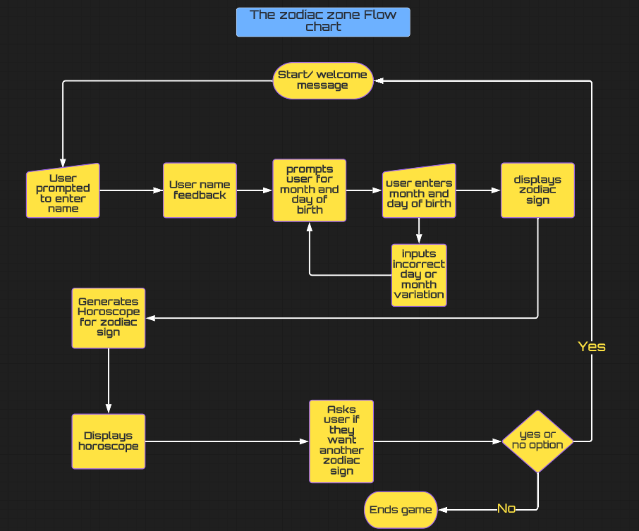
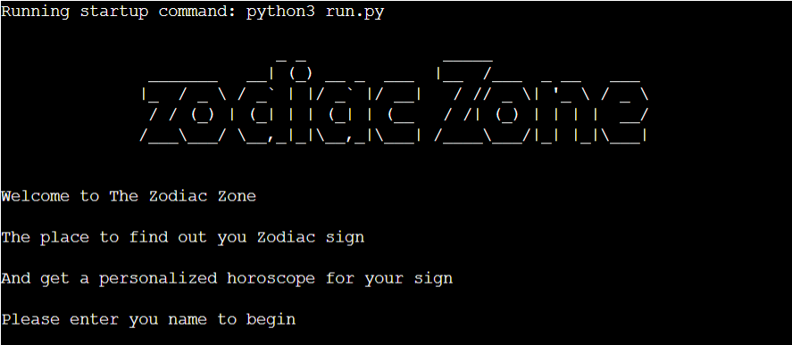
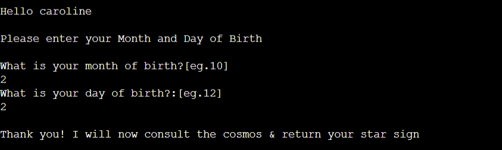
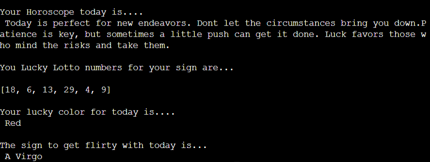
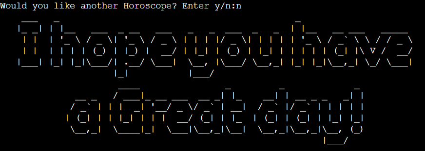
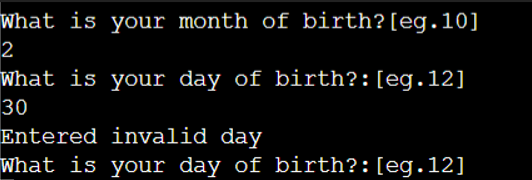
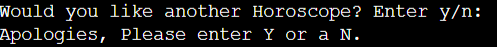
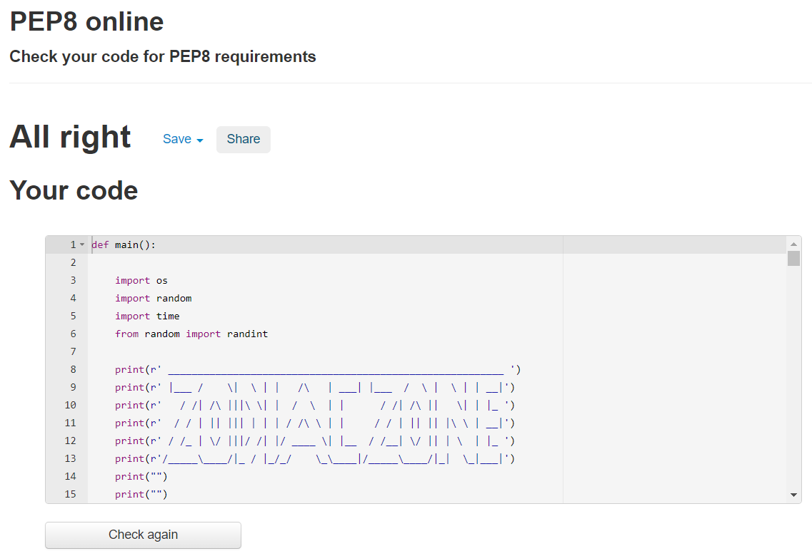

# Zodiac Zone

### **[Live link to Zodiac Zone.](https://zodiac-zone.herokuapp.com/)**
---

# Table of contents:
- ##  [Context](#context)

- ##  [Design](#Design)
     - [Target audience](#Target-audience)
     - [Overview](#Overview)
     - [User Stories](#User-stories)
     - [Flowchart](#Flowchart)

- ##  [Features](#Features)     
     - [Existing features](#Existing-features) 
     - [Application start](#Application-start)
     - [User input](#User-input)
     - [User feedback](#User-feedback)
     - [Horoscope display](#Horoscope-display)
     - [End of application](#End-of-application)

- ##  [Future Features](#Future-Features) 

- ##  [Testing](#Testing)

- ##  [Technologies Used](#Technologies-Used)
     - [Languages](#Languages)
     - [Libraries](#Libraries)

- ##  [Bugs](#Bugs)
     - [Unfixed Bugs](#Unfixed-bugs)

- ##  [Validators](#Validators)

- ##  [Deployment](#Deployment)

- ##  [Credits](#Credits)
    

# Context

Zodiac zone is a random Horoscope generator. It uses the standard Western astrology and the twelve [Astrological signs](https://en.wikipedia.org/wiki/Astrological_sign) associated with western horoscopes.

The application is simple:
- Asks the user to input name.
- Asks the user for Month of birth.
- Asks the user for Day of birth.
- Generates a random Horoscope and displays the outcome.
- Provides user with random generated lucky lotto numbers
- Provides user with random lucky color.
- Provides the user with another zodiac sign the might like to get to know.

This application is for fun and out come from the users input is generated randomly.

# Design

## Target Audience
 - Anyone who enjoys Zodiac related material.
 - Any user who is interested in a short but fun application
 - New Users who would like to try something fun and personal.

## Overview
  - Simple to use
  - Responsive feedback
  - Insightful but positive outcome from random generated horoscopes
  - Fun and interactive application.

## User stories

### First time user:
  1. To be able to access the application with ease.
  2. Have clear navigation.
  3. Easy to read and understand instructions.
  4. Fun interactive application

### Returning user:
  1. To be entertained.
  2. Navigate with ease
  3. Clear easy path to starting and restarting the application

### As site owner:
  1. To be able the output from the generated horoscopes
  2. To make a fun and entertaining application
  3. To make sure the user has fun using the application.

## Flowchart

I designed a basic flowchart on [Lucid Chart](https://www.lucidchart.com/) first.This was to give me a template to follow and to make sure my original design that I had planned was the outcome and final layout of the application. This was an essential piece to the over all project as it helped me keep track of how the application would be displayed to the user and the steps the user would take within the application.

- Where were inputs from the user needed?
- How would I deal with invalid inputs?
- Were there any logic errors that could break the loop of the application?

 # Features 

  ## Existing features 
  - ## Application start 
    - Main logo was created with [Pyfiglet](https://www.geeksforgeeks.org/python-ascii-art-using-pyfiglet-module/#:~:text=pyfiglet%20takes%20ASCII%20text%20and,1%3A%20Text%20in%20default%20font/) to generate ASCII art and give a nice aesthetic to an other wise plain terminal.
    - Landing page with application logo
    - Welcome message.
    - Information about what the appliction is for. 
    - Text prompt for user to enter name.
    
  
  ---

  - ## User input
    - User follows on screen text prompts.
    - User enters name.
    - Application feed back letting user know what is happening.
  
  
  ---

  - ## User feedback
    - Displays to the user that the appliction is calculating the star sign for the information the user input.
    - Lets the user know the calculated zodiac sign for month and day input by user.
    - Displays that a personal horoscope is generating give constant feedback to the user.

  
   ---

  - ## Horoscope display
    - Displays the randomly generated horoscope
    - Gives the user randomly generated lotto numbers
    - Suggests to the user a lucky color for that day and sign
    - Displays another sign for the user to get flirty with.
    
  

  - ## End of application
   - At the end of the horoscope generation cycle, User is asked if they want another horoscope
   - If the user inputs Y for another horoscope, appliction starts again.
   - If the user inputs N the applications ends.
   - End text was created with [Pyfiglet](https://www.geeksforgeeks.org/python-ascii-art-using-pyfiglet-module/#:~:text=pyfiglet%20takes%20ASCII%20text%20and,1%3A%20Text%20in%20default%20font/) to generate ASCII art and add nice exit message for the user.
   
  
  
  - ## Error handling
   - In the event the user input a wrong day month combination ie chooses day 31 in a month with only 30 days application throws an error
   - In the event the user inputs anything except a Y or N when asked if they would like another horoscope.

  
  
  
  
  
------

- # Future Features
   - To give the option for Western or Chinese Astrology
   - To take input of Year of Birth to calculate Chinese Astrology sign.
   - Nicer background design to brighten up the terminal that application is displayed on.
---

- # Testing

- I manually tested the application through [PEP8 online check](http://pep8online.com/). 
- I manually testing the application in github by running print() and inputting errors to test the error handling at multiple stages.
- Errors or warnings were fixed as they appeared such as indentation errors, lines too long or extra space issues. This helped keep the code clean and readable so other errors or bugs that arose were identified more easily.
- Any testing user inputs were printed back to the console to check all functions and methods were correctly applied to the input.
- The game was deployed early on in development and checked regularly to ensure game flow and any errors were handled early on.

---

- # Technologies Used
  - Github for my Respositiory for the application Zodiac Zone
  - Gitpod for coding the application
  - Heroku for Deployment of the application
  - [Pyfiglet](https://www.geeksforgeeks.org/python-ascii-art-using-pyfiglet-module/#:~:text=pyfiglet%20takes%20ASCII%20text%20and,1%3A%20Text%20in%20default%20font/) was added to requirements.txt then for deployment to Heroku.
  

- ## Languages
  - Python 

- ## Libraries
  -  import os
  -  import random
  -  import time
  -  from random import randint
  -  import pyfiglet 
---

- # Bugs

- The month and day didn't throw error when a wrong day month combination or non numerical value was entered.
  - Fixed: Error logic was correct but implementation was incorrect, removed integer (int) from the where I had had month and day defined.

- The application would not except 29th of February as a Date of Birth. 
  - Fixed: I had a import of datetime from date and this was counteracting the month and day input as it was seeing the user input as a date and not numerical values. As I wasn't working with dates exactly so I removed this import and and adjusted the maximum day value for month number 2, to except 29th February as a date of Birth input.  

- PEP8 had amber warning "Line break before binary operator". I had several of these warning relating to a section of code.
  - Fixed: The the lines of code in if , elif, else statement I used to calculate the month and day the user inputs to correspond with a star sign were too long. I had seperated the individual statements into two smaller lines. I placed the "OR" operator on the second line, when I should have had it at the end the first line. Correted this error and code passed PEP8
----

- # Unfixed Bug
 - No current unfixed bug known.

- # Validators
 - This project was validated with [PEP8 online check](http://pep8online.com/)
 - After debugging process application passed without any errors. 

- # Deployment
The site was deployed via [Heroku]( https://id.heroku.com/login), and the live link can be found here: [Zodiac Zone](https://zodiac-zone.herokuapp.com/)

- Before deploying to Heroku pip3 freeze > requirements.txt was used to add pyfiglet for deployment.

This project was developed utilising the Code Institute Template. Due to security issues between Github and Heroku my project was deployed via Gitpod terminal manually to link Github and Heroku. Once the project was created config vars and buildpacks could be added to project within Heroku settings.

1. Create an account on [Heroku]( https://id.heroku.com/login)
2. In the terminal of your project that you want to deploy run the command heroku login -i and login with your credentials you use to create an account on Heroku when prompted.
3. Run the command heroku create zodiac-zone --region=eu to create the new app with European region as it automatically defaults to U.S region.
This will link it to your Gitpod terminal.
4. The app is now accessible through the Heroku dashboard.
5. In the settings options on heroku dashboard scroll down until you see config vars. Enter Key PORT and Value 8000 and add to app
6. Under config vars is buildpack option, in this section you select buildpacks Python and Node js for the application to run.

    Once the application has been created, steps to deploy the application:
1. Run the command heroku login -i and log in with you Heroku dashboard credentials. Email and password use to set up Heroku.
2. Then run the following command heroku git:remote -a zodiac-zone . This is for when you are sigining back into Heroku before pushing updated code to Heroku.
3. After you app is linked to your work space you can deploy new version of the app to Heroku with the command git push heroku main.
4. Your app is now deployed to Heroku
---

- # Credits
- [Hackernoon]( https://hackernoon.com/want-to-learn-python-lets-do-it-with-horoscopes-raq44oo)
  This site helped with the idea for the list to randomly generate the horoscope.

- [Cppsecrets]( https://cppsecrets.com/users/5271114105115104979810446114107495548525364103109971051084699111109/Simple-Python-Projects-Simple-Zodiac-Sign-Teller.php)
  After viewing a few horoscope generating projects, this site help me develop the if , elif, else statement used to calculate the month and day the user inputs to correspond with a star sign.

- [Geeks-for-Geeks](https://www.geeksforgeeks.org/python-ascii-art-using-pyfiglet-module/#:~:text=pyfiglet%20takes%20ASCII%20text%20and,1%3A%20Text%20in%20default%20font)
  Credit to geeks for geeks on how to use and impliment code for ASCII generated art for main logo and exit message.

- [Amuls-Academy](https://www.youtube.com/watch?v=-Z5qhTocLSo)
  During debugging process, I realised that month would take any day value inc 31 days in a month with only 30 days. So with the help of this video tutorial, I was able to implement code that would recognise 30 days in a 30 day month or throw and error if invalid combination.

- [Python-Course.eu](https://python-course.eu/python-tutorial/errors-and-exception-handling.php)
Error handling was a important part of the application development process. This site helped me understand and implement correct code to throw an error if user inputs an invalid entry.

- I also used slack archives to help with debugging and heroku issues for deployment.
