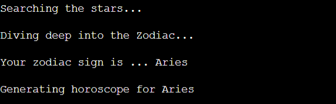
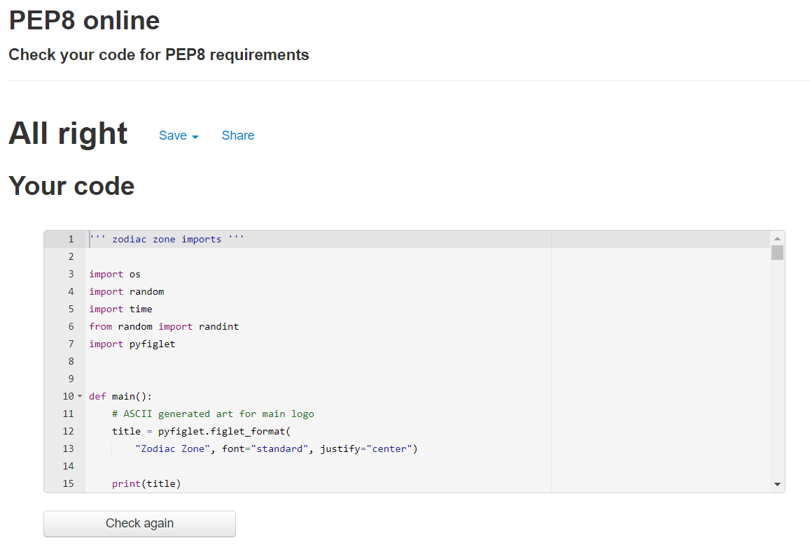

# Zodiac Zone

### **[Live link to deployed application.](https://zodiac-zone.herokuapp.com/)**
---

# Table of contents:
- ##  [Context](#context)

- ##  [Design](#Design)
     - [Target audience](#Target-audience)
     - [Overview](#Overview)
     - [User Stories](#User-stories)
     - [Flowchart](#Flowchart)

- ##  [Features](#Features)     
     - [Existing features](#Existing-features) 
     - [Application start](#Application-start)
     - [User input](#User-input)
     - [User feedback](#User-feedback)
     - [Horoscope display](#Horoscope-display)
     - [End of application](#End-of-application)

- ##  [Future Features](#Future-Features) 

- ##  [Testing](#Testing)

- ##  [Technologies Used](#Technologies-Used)
     - [Languages](#Languages)
     - [Libraries](#Libraries)

- ##  [Bugs](#Bugs)
     - [Unfixed Bugs](#Unfixed-bugs)

- ##  [Validators](#Validators)

- ##  [Deployment](#Deployment)
    

# Context

Zodiac zone is a random Horoscope generator. It uses the standard Western astrology and the twelve [Astrological signs](https://en.wikipedia.org/wiki/Astrological_sign) associated with western horoscopes.

The application is simple:
- Asks the user to input name.
- Asks the user for Month of birth.
- Asks the user for Day of birth.
- Generates a random Horoscope and displays the outcome.
- Provides user with random generated lucky lotto numbers
- Provides user with random lucky color.
- Provides the user with another zodiac sign the might like to get to know.

This application is for fun and out come from the users input is generated randomly.

# Design

## Target Audience
 - Anyone who enjoys Zodiac related material.
 - Any user who is interested in a short but fun application
 - New Users who would like to try something fun and personal.

## Overview
  - Simple to use
  - Responsive feedback
  - Insightful but positive outcome from random generated horoscopes
  - Fun and interactive application.

## User stories

### First time user:
  1. To be able to access the application with ease.
  2. Have clear navigation.
  3. Easy to read and understand instructions.
  4. Fun interactive application

### Returning user:
  1. To be entertained.
  2. Navigate with ease
  3. Clear easy path to starting and restarting the application

### As site owner:
  1. To be able the output from the generated horoscopes
  2. To make a fun and entertaining application
  3. To make sure the user has fun using the application.

## Flowchart

I designed a basic flowchart on [Lucid Chart](https://www.lucidchart.com/) first.This was to give me a template to follow and to make sure my original design that I had planned was the outcome and final layout of the application. This was an essential piece to the over all project as it helped me keep track of how the application would be displayed to the user and the steps the user would take within the application.

- Where were inputs from the user needed?
- How would I deal with invalid inputs?
- Were there any logic errors that could break the loop of the application?

 # Features 

  ## Existing features 
  - ## Application start 
    - Landing page with application logo
    - Welcome message.
    - Information about what the appliction is for. 
    - Text prompt for user to enter name.
    
  
  ---

  - ## User input
    - User follows on screen text prompts.
    - User enters name.
    - Application feed back letting user know what is happening.
  
  
  ---

  - ## User feedback
    - Displays to the user that the appliction is calculating the star sign for the information the user input.
    - Lets the user know the calculated zodiac sign for month and day input by user.
    - Displays that a personal horoscope is generating give constant feedback to the user.

  
   ---

  - ## Horoscope display
    - Displays the randomly generated horoscope
    - Gives the user randomly generated lotto numbers
    - Suggests to the user a lucky color for that day and sign
    - Displays another sign for the user to get flirty with.
    
  

  - ## End of application
   - At the end of the horoscope generation cycle, User is asked if they want another horoscop
   - If the user inputs Y for another horoscope, appliction starts again.
   - If the user inputs N the applications ends.
   
  
  
  - ## Error handling
   - In the event the user input a wrong day month combination ie chooses day 31 in a month with only 30 days application throw error
   - In the event the user inputs anything except a Y or N when asked if they would like another horoscope.

  
  
  
  
  
------

- # Future Features
   - To give the option for Western or Chinese Astrology
   - To take input of Year of Birth to calculate Chinese Astrology sign.
   - Nicer background design to brighten up the terminal that application is displayed on.
---

- # Testing

- I manually tested the application through [PEP8 online check](http://pep8online.com/). 
- I manually testing the application in github by running Python3 run.py and inputting errors to test the error handling at multiple stages.
- After deploying to Herouku I tested the application again to get errors displaying and working out any bugs I previouly over looked.

---

- # Technologies Used
  - Github for my Respositiory for the application Zodiac Zone
  - Gitpod for coding the application
  - Heroku for Deployment of the application

- ## Languages
  - Python 

- ## Libraries
  -  import os
  -  import random
  -  import time
  -  from random import randint
  -  import pyfiglet 
---

- # Bugs

- The month and day didn't throw error when a wrong day month combination or non numerical value was entered.
  - Fixed: Error logic was correct but implementation was incorrect, removed integer (int) from the where I had had month and day defined.

- The application would not except 29th of February as a Date of Birth. 
  - Fixed: I had a import of datetime from date and this was counteracting the month and day input as it was seeing the user input as a date and not numerical values. As I wasn't working with dates exactly I removed this import and and adjusted the maximum day value to except 29th February as a date of Birth.  

- PEP8 had amber warning "Line break before binary operator". I had several of these warning relating to a section of code.
  - Fixed: The the lines of code in if , elif, else statement I used to calculate the month and day the user inputs to correspond with a star sign were too long. I had seperated the individual statements into two smaller lines. I placed the "OR" operator on the second line, when I should have had it at the end the first line. Correted this error and code passed PEP8

- # Unfixed Bug
 - No current unfixed bug known.

- # Validators
 - This project was validated with [PEP8 online check](http://pep8online.com/)
 - After debugging process application passed without any errors. 

- # Deployment